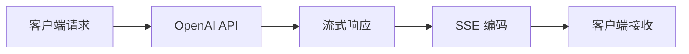
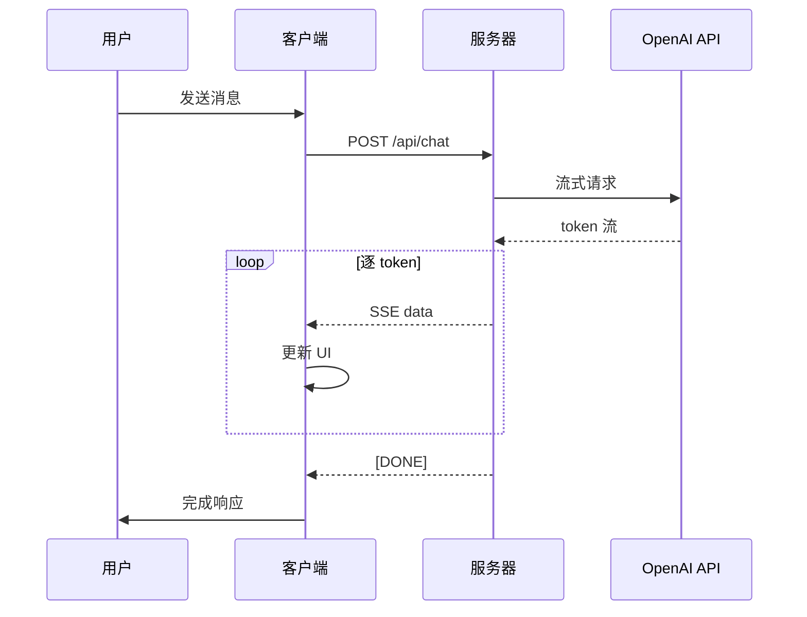
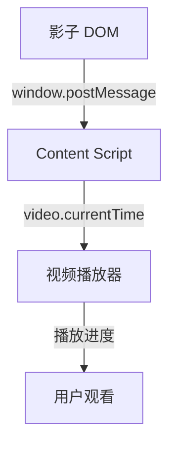
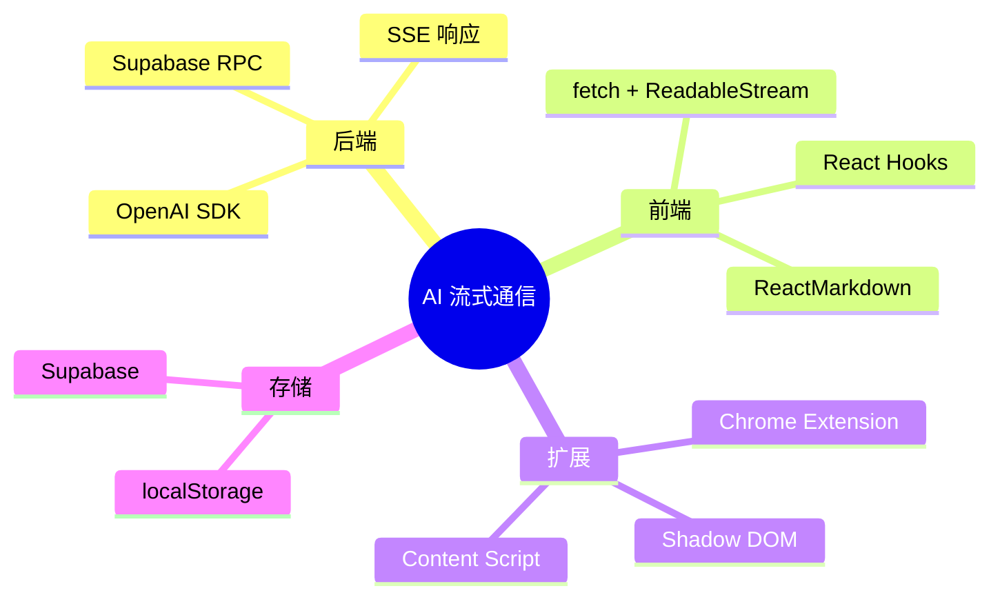

# AI 流式通信实战：SSE + fetch + ReadableStream

> **核心价值**：在开发 AI 对话应用时，流式输出是提升用户体验的关键。本文将深入讲解如何基于 OpenAI SDK 和前端流式处理技术，实现逐 token 推送的打字机效果。

## 📋 目录

- [技术亮点](#技术亮点)
- [为什么选择 fetch + ReadableStream？](#为什么选择-fetch--readablestream)
- [后端实现：SSE 响应](#后端实现sse-响应)
- [前端实现：流式消费](#前端实现流式消费)
- [高级功能集成](#高级功能集成)
- [性能优化](#性能优化)
- [总结](#总结)

---

## 🎯 技术亮点

| 技术模块 | 实现方案 | 核心价值 |
|---------|---------|----------|
| **AI 模型集成** | GLM-4 + 豆包语音 AI | 构建语音识别至语义理解技术链路 |
| **Chrome 扩展通信** | `window.postMessage` | 影子 DOM 向 Content Script 发送指令，实现视频进度跳转 |
| **优化 Prompt** | XML 格式替换 Markdown | 增强提示词结构性，提升模型输出准确性 |
| **AI 流式通信** | OpenAI SDK + SSE | 后端构造 SSE 响应逐 token 推送 |
| **前端流式处理** | `fetch + ReadableStream` | 替代 `EventSource` 实现 POST 场景下流式通信 |
| **打字机效果** | React 状态管理 | 流式数据驱动逐块 UI 更新 |
| **动态渲染** | ReactMarkdown + 正则 | 生成时间戳按钮，触发视频进度控制 |
| **用户双鉴** | token + IP 哈希 | 双重标识识别用户 |
| **对话存聊** | localStorage | 本地聊天记录持久化 |
| **Supabase 原子计数** | 数据库原子函数 | 封装计数逻辑，减少 API 请求次数 |

## 🤔 为什么选择 fetch + ReadableStream？

### EventSource vs fetch + ReadableStream 对比

| 特性 | EventSource | fetch + ReadableStream | 推荐 |
|------|:-----------:|:----------------------:|:----:|
| 请求方法 | 仅支持 GET | 支持 POST/GET | ✅ |
| 请求头 | 无法自定义 | 完全自定义 | ✅ |
| 请求体 | 无法携带 | 支持任意格式 | ✅ |
| 浏览器支持 | 较好 | 现代浏览器 | ✅ |
| 错误处理 | 有限 | 完整的 Promise 链 | ✅ |
| 可中断性 | 自动重连 | 手动控制 | ✅ |

> 💡 **关键决策**：由于 AI 对话通常需要 POST 请求携带上下文（如对话历史、用户偏好等），我们选择 `fetch + ReadableStream` 方案，它提供了更灵活的控制能力和更好的错误处理机制。

---

## 🔧 后端实现：SSE 响应

### 核心架构



### 完整代码实现

```typescript title="app/api/chat/route.ts"
import OpenAI from 'openai'

const openai = new OpenAI({
  apiKey: process.env.OPENAI_API_KEY,
})

export async function POST(request: Request) {
  const { messages } = await request.json()

  // 创建流式聊天完成
  const stream = await openai.chat.completions.create({
    model: 'gpt-4',
    messages,
    stream: true,
  })

  const encoder = new TextEncoder()

  // 构造 ReadableStream
  const readable = new ReadableStream({
    async start(controller) {
      try {
        for await (const chunk of stream) {
          const content = chunk.choices[0]?.delta?.content || ''
          if (content) {
            // SSE 格式: data: {JSON}\n\n
            const data = `data: ${JSON.stringify({ content })}\n\n`
            controller.enqueue(encoder.encode(data))
          }
        }
        // 发送结束标记
        controller.enqueue(encoder.encode('data: [DONE]\n\n'))
        controller.close()
      } catch (error) {
        controller.error(error)
      }
    },
  })

  return new Response(readable, {
    headers: {
      'Content-Type': 'text/event-stream',
      'Cache-Control': 'no-cache',
      'Connection': 'keep-alive',
    },
  })
}
```

> ⚠️ **注意事项**：
> - 必须设置 `Content-Type: text/event-stream`
> - `Cache-Control: no-cache` 防止浏览器缓存
> - `Connection: keep-alive` 保持长连接
```

---

## 🎨 前端实现：流式消费

### 流程图



### 基础流式读取

```typescript title="lib/streamChat.ts"
async function* streamChat(messages: Message[]) {
  const response = await fetch('/api/chat', {
    method: 'POST',
    headers: { 'Content-Type': 'application/json' },
    body: JSON.stringify({ messages }),
  })

  if (!response.ok) {
    throw new Error(`HTTP error! status: ${response.status}`)
  }

  const reader = response.body?.getReader()
  const decoder = new TextDecoder()

  while (reader) {
    const { done, value } = await reader.read()
    if (done) break

    const chunk = decoder.decode(value)
    const lines = chunk.split('\n').filter(line => line.startsWith('data: '))

    for (const line of lines) {
      const data = line.replace('data: ', '')
      if (data === '[DONE]') return

      try {
        const { content } = JSON.parse(data)
        yield content
      } catch (e) {
        console.error('Failed to parse SSE data:', e)
      }
    }
  }
}
```

### React Hook：打字机效果

```tsx title="hooks/useStreamingChat.ts"
import { useState, useCallback } from 'react'

interface Message {
  role: 'user' | 'assistant'
  content: string
}

function useStreamingChat() {
  const [content, setContent] = useState('')
  const [isStreaming, setIsStreaming] = useState(false)

  const sendMessage = useCallback(async (messages: Message[]) => {
    setContent('')
    setIsStreaming(true)

    try {
      for await (const token of streamChat(messages)) {
        setContent(prev => prev + token)
      }
    } catch (error) {
      console.error('Streaming error:', error)
      setContent('抱歉，发生了错误，请重试。')
    } finally {
      setIsStreaming(false)
    }
  }, [])

  return { content, isStreaming, sendMessage }
}

export default useStreamingChat
```
```

## 🚀 高级功能集成

### 1. ReactMarkdown 动态渲染

```tsx title="components/ChatMessage.tsx"
import ReactMarkdown from 'react-markdown'
import { Prism as SyntaxHighlighter } from 'react-syntax-highlighter'
import { oneDark } from 'react-syntax-highlighter/dist/esm/styles/prism'

interface ChatMessageProps {
  content: string
}

function ChatMessage({ content }: ChatMessageProps) {
  return (
    <div className="prose prose-invert max-w-none">
      <ReactMarkdown
        components={{
          code({ node, inline, className, children, ...props }) {
            const match = /language-(\w+)/.exec(className || '')
            return !inline && match ? (
              <SyntaxHighlighter
                style={oneDark}
                language={match[1]}
                PreTag="div"
                {...props}
              >
                {String(children).replace(/\n$/, '')}
              </SyntaxHighlighter>
            ) : (
              <code className={className} {...props}>
                {children}
              </code>
            )
          },
        }}
      >
        {content}
      </ReactMarkdown>
    </div>
  )
}

export default ChatMessage
```

### 2. 时间戳按钮生成

> 💡 **功能说明**：通过正则表达式识别时间戳（如 `[05:30]`），生成可点击按钮触发视频跳转。

```tsx title="utils/parseTimestamps.tsx"
interface TimestampProps {
  content: string
  onTimestampClick: (time: number) => void
}

function parseTimestamps({ content, onTimestampClick }: TimestampProps) {
  const timestampRegex = /\[(\d{1,2}:\d{2})\]/g

  return content.split(timestampRegex).map((part, index) => {
    if (index % 2 === 1) {
      const [minutes, seconds] = part.split(':').map(Number)
      const time = minutes * 60 + seconds

      return (
        <button
          key={index}
          onClick={() => onTimestampClick(time)}
          className="px-2 py-1 bg-accent-green/20 text-accent-green rounded hover:bg-accent-green/30 transition-colors"
        >
          [{part}]
        </button>
      )
    }
    return part
  })
}

export default parseTimestamps
```

### 3. Chrome 扩展通信

#### 架构说明



#### 实现代码

```typescript title="extension/shadowDOM.ts"
// 影子 DOM 中发送消息
function jumpToTime(time: number) {
  window.postMessage({
    type: 'JUMP_TO_TIME',
    payload: { time }
  }, '*')
}
```

```typescript title="extension/contentScript.ts"
// Content Script 监听消息
window.addEventListener('message', (event) => {
  // 安全检查：只接受来自同一窗口的消息
  if (event.source !== window) return
  
  if (event.data.type === 'JUMP_TO_TIME') {
    const video = document.querySelector('video')
    if (video) {
      video.currentTime = event.data.payload.time
      video.play().catch(err => console.error('Failed to play:', err))
    }
  }
})
```
```

### 4. 用户双鉴与对话存储

#### 双重标识识别

```typescript title="lib/auth.ts"
import crypto from 'crypto'

// token + IP 哈希双重标识
async function getUserIdentity(request: Request) {
  const token = request.headers.get('Authorization')?.replace('Bearer ', '')
  const ip = request.headers.get('x-forwarded-for') || 
             request.headers.get('x-real-ip') || 
             'unknown'
  
  // IP 哈希保护隐私
  const ipHash = crypto
    .createHash('sha256')
    .update(ip)
    .digest('hex')
    .substring(0, 16)

  return {
    token,
    ipHash,
    identifier: `${token}_${ipHash}`
  }
}

export default getUserIdentity
```

#### 本地聊天记录存储

```typescript title="lib/chatStorage.ts"
interface ChatMessage {
  role: 'user' | 'assistant'
  content: string
  timestamp: number
}

interface ChatSession {
  id: string
  messages: ChatMessage[]
  createdAt: number
  updatedAt: number
}

// 保存聊天记录
function saveChatHistory(sessionId: string, messages: ChatMessage[]) {
  const session: ChatSession = {
    id: sessionId,
    messages,
    createdAt: Date.now(),
    updatedAt: Date.now()
  }
  localStorage.setItem(`chat_${sessionId}`, JSON.stringify(session))
}

// 加载聊天记录
function loadChatHistory(sessionId: string): ChatMessage[] {
  const data = localStorage.getItem(`chat_${sessionId}`)
  if (!data) return []
  
  try {
    const session: ChatSession = JSON.parse(data)
    return session.messages
  } catch (e) {
    console.error('Failed to parse chat history:', e)
    return []
  }
}

// 删除聊天记录
function deleteChatHistory(sessionId: string) {
  localStorage.removeItem(`chat_${sessionId}`)
}

export { saveChatHistory, loadChatHistory, deleteChatHistory }
export type { ChatMessage, ChatSession }
```

### 5. Supabase 原子计数

> 💡 **性能优化**：封装用户行为计数逻辑为数据库原子函数，通过 RPC 单次调用减少 API 请求次数。

```typescript title="lib/supabase.ts"
import { createClient } from '@supabase/supabase-js'

const supabase = createClient(
  process.env.SUPABASE_URL!,
  process.env.SUPABASE_ANON_KEY!
)

// Supabase RPC 调用
async function incrementUserCount(userId: string, actionType: string) {
  const { data, error } = await supabase.rpc('increment_user_count', {
    user_id: userId,
    action_type: actionType
  })

  if (error) {
    console.error('Failed to increment count:', error)
    return null
  }

  return data
}

export { incrementUserCount }
```

```sql title="database/functions.sql"
-- 数据库原子函数
CREATE OR REPLACE FUNCTION increment_user_count(
  user_id UUID,
  action_type TEXT
)
RETURNS INTEGER AS $
BEGIN
  INSERT INTO user_counts (user_id, action_type, count)
  VALUES (user_id, action_type, 1)
  ON CONFLICT (user_id, action_type)
  DO UPDATE SET 
    count = user_counts.count + 1,
    updated_at = NOW()
  RETURNING count;
END;
$ LANGUAGE plpgsql;

-- 创建索引提升查询性能
CREATE INDEX idx_user_counts_user_action 
ON user_counts(user_id, action_type);
```
```

---

## ⚡ 性能优化

### 1. 节流渲染

> ⚠️ **性能问题**：高频 token 更新可能导致 UI 卡顿，使用 `requestAnimationFrame` 节流。

```typescript title="utils/throttleRender.ts"
let pendingContent = ''
let frameId: number | null = null

function scheduleRender(newContent: string, setContent: (content: string) => void) {
  pendingContent = newContent
  
  if (frameId === null) {
    frameId = requestAnimationFrame(() => {
      setContent(pendingContent)
      frameId = null
    })
  }
}

// 清理函数
function cleanup() {
  if (frameId !== null) {
    cancelAnimationFrame(frameId)
    frameId = null
  }
}

export { scheduleRender, cleanup }
```

### 2. 取消请求

```typescript title="hooks/useStreamingChat.ts"
import { useRef } from 'react'

function useStreamingChat() {
  const controllerRef = useRef<AbortController | null>(null)

  const sendMessage = async (messages: Message[]) => {
    // 取消之前的请求
    if (controllerRef.current) {
      controllerRef.current.abort()
    }

    // 创建新的 AbortController
    controllerRef.current = new AbortController()

    try {
      const response = await fetch('/api/chat', {
        method: 'POST',
        body: JSON.stringify({ messages }),
        signal: controllerRef.current.signal,
      })
      // ... 处理响应
    } catch (error) {
      if (error.name === 'AbortError') {
        console.log('Request was aborted')
      } else {
        console.error('Request failed:', error)
      }
    }
  }

  const abort = () => {
    if (controllerRef.current) {
      controllerRef.current.abort()
      controllerRef.current = null
    }
  }

  return { sendMessage, abort }
}

export default useStreamingChat
```

### 3. 内存优化

```typescript title="utils/memoryOptimization.ts"
// 限制历史消息数量
const MAX_HISTORY_LENGTH = 50

function trimMessages(messages: Message[]): Message[] {
  if (messages.length <= MAX_HISTORY_LENGTH) {
    return messages
  }
  
  // 保留最近的 N 条消息
  return messages.slice(-MAX_HISTORY_LENGTH)
}

// 清理过期的本地存储
function cleanupOldSessions(maxAge: number = 7 * 24 * 60 * 60 * 1000) {
  const now = Date.now()
  const keys = Object.keys(localStorage)
  
  keys.forEach(key => {
    if (key.startsWith('chat_')) {
      const data = localStorage.getItem(key)
      if (data) {
        const session = JSON.parse(data)
        if (now - session.updatedAt > maxAge) {
          localStorage.removeItem(key)
        }
      }
    }
  })
}

export { trimMessages, cleanupOldSessions }
```

---

## 📊 总结

### 核心成果

| 功能模块 | 技术方案 | 用户体验提升 |
|---------|---------|------------|
| **实时打字机效果** | `fetch + ReadableStream` | ⭐⭐⭐⭐⭐ 即时反馈 |
| **POST 请求支持** | SSE over POST | ⭐⭐⭐⭐⭐ 携带上下文 |
| **ReactMarkdown 动态渲染** | ReactMarkdown + 代码高亮 | ⭐⭐⭐⭐ 格式化展示 |
| **时间戳识别与视频跳转** | 正则 + Chrome 扩展 | ⭐⭐⭐⭐⭐ 快速定位 |
| **用户双鉴与对话存储** | token + IP 哈希 + localStorage | ⭐⭐⭐⭐ 跨会话保留 |
| **Supabase 原子计数** | RPC + 数据库函数 | ⭐⭐⭐⭐ 性能优化 |

### 技术栈总览



### 最佳实践

1. **错误处理**：始终添加 try-catch 和错误边界
2. **性能优化**：使用 `requestAnimationFrame` 节流渲染
3. **用户体验**：支持中断生成、显示加载状态
4. **安全性**：验证用户身份、保护敏感数据
5. **可维护性**：模块化代码、添加类型定义

---

> 🎉 **项目落地**：这套方案已在 [DeepView](https://github.com/your-repo/deepview) 项目中落地，支持多种视频平台接入，获得了良好的用户反馈。

> 📝 **相关资源**：
> - [OpenAI API 文档](https://platform.openai.com/docs/api-reference/streaming)
> - [MDN: ReadableStream](https://developer.mozilla.org/en-US/docs/Web/API/ReadableStream)
> - [Chrome Extension 开发指南](https://developer.chrome.com/docs/extensions/)
